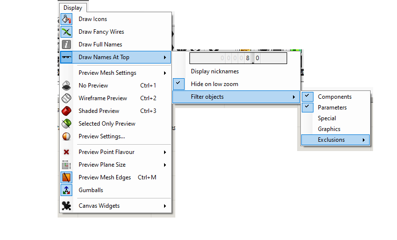


<h1 align="center"> Sunglasses </h1>

 

 Draw the name (or nickname) of Grasshopper objects, to allow you to use the Icon Mode and have the name visible at the same time.

#### Preview

 

#### Installation
0) Download the last release of *Sunglasses.gha* from [here](https://github.com/DanielAbalde/Sunglasses/releases/tag/v1.0).
1) Make sure *Sunglasses.gha* is <ins>unlocked</ins>, right click > Properties > Unlock (if visible).
2) Copy and paste it in the Grasshopper Libraries folder, usually: C:\Users\\<YourUser\>\AppData\Roaming\Grasshopper\Libraries.
3) Restart Rhinoceros and Grasshopper.
4) Access from Grasshopper Toolbar > Display > Draw Names At Top.
 
#### Usage
This plugin does not contain any components. Access the user settings from <ins>Grasshopper Toolbar > Display > Draw Names At Top</ins> to enable or disable, draw the nickname instead of name, change the size of the font and include or exclude objects to display the name.

These user settings are stored in grasshopper_kernel.xml file in the Grasshopper folder, with the prefix "Sunglasses".
   
 

#### License

This project is free software: you can redistribute it and/or modify
it under the terms of the [GNU General Public License](https://www.gnu.org/licenses/gpl-3.0.en.html) as published by
the Free Software Foundation, either version 3 of the License, or
(at your option) any later version.

This program is distributed in the hope that it will be useful,
but WITHOUT ANY WARRANTY; without even the implied warranty of
MERCHANTABILITY or FITNESS FOR A PARTICULAR PURPOSE.  See the
GNU General Public License for more details.