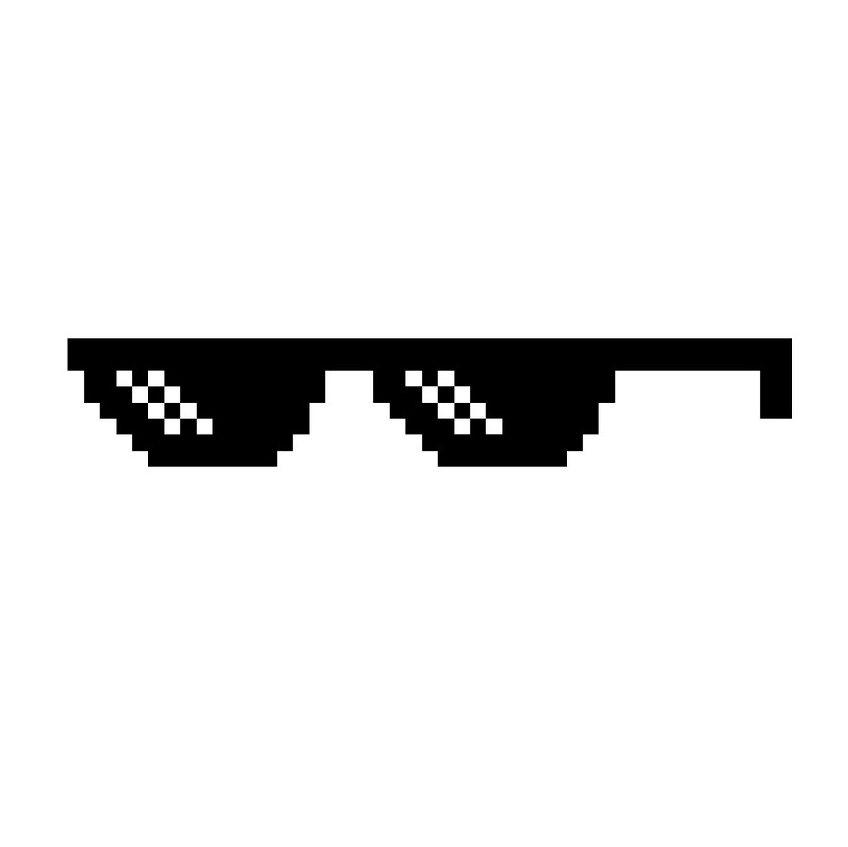
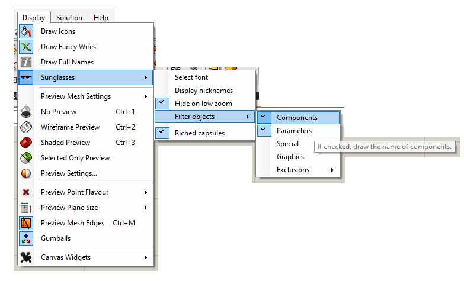


<h1 align="center"> Sunglasses </h1>

 

Draw the name (or nickname) of Grasshopper objects with Draw Icons mode on. It also enriches the capsules when you zoom in to understand the component and visualise its data at a quick glance.

## 😎 Overview
The advantage with the alternatives (and the reason for it) is that this is a purely graphic plugin, you don’t need any component to use it, it is modified via toolbar, and it doesn’t create any object inside the canvas either, it only affects the canvas visually. Besides, you look much more stunning with them.

 

 

## 🔌 Installation

From food4Rhino:

0) Download the last version of *Sunglasses.gha* from [Food4Rhino](https://www.food4rhino.com/app/sunglasses).
1) Make sure *Sunglasses.gha* is <ins>unlocked</ins>, right click > Properties > Unlock (if visible).
2) Copy and paste it in the Grasshopper Libraries folder, usually: C:\Users\\<YourUser\>\AppData\Roaming\Grasshopper\Libraries.
3) Restart Rhinoceros and Grasshopper.
4) Access from Grasshopper Toolbar > Display > Sunglasses.
 
From YAK (for Rhino 7 and above):

0) Type <ins>PackageManager</ins> in the rhino command prompt.
1) In the Online tab, type "sunglasses" in the search box.
2) Install last version.
3) Restart Rhino and Grasshopper.
 
## 📖 Usage
This plugin does not contain any components. Access the user settings from <ins>Grasshopper Toolbar > Display > Sunglasses</ins> to enable or disable, change the font, draw the nickname instead of name, and include or exclude objects to display the name.
 
 

From version 1.1.0, there is another feature to visualise the content of components and parameters by zooming in on the capsules, when Display > Draw Icons is activated. Enable it from <ins>Grasshopper Toolbar >Display > Sunglasses > Riched capsules</ins>.

 

These user settings are stored in grasshopper_kernel.xml file in the Grasshopper folder, with the prefix "Sunglasses". You could edit them manually from there or delete them if you want to restore the default values.
  

## 🌈 License

This project is free software: you can redistribute it and/or modify it under the terms of the [GNU General Public License](https://www.gnu.org/licenses/gpl-3.0.en.html) as published by the Free Software Foundation, either version 3 of the License, or (at your option) any later version.

This program is distributed in the hope that it will be useful, but WITHOUT ANY WARRANTY; without even the implied warranty of MERCHANTABILITY or FITNESS FOR A PARTICULAR PURPOSE. See the GNU General Public License for more details.

## 🍻 Donation

You can invite me to a beer using Paypal from [here](https://www.paypal.com/paypalme/danielabalde). Thank you!

## ❓ Questions & Feedback

Please use [this post](https://discourse.mcneel.com/t/sunglasses-gh-plugin-to-display-object-names/115550) to make your suggestions or questions.
Or contribute using github.
